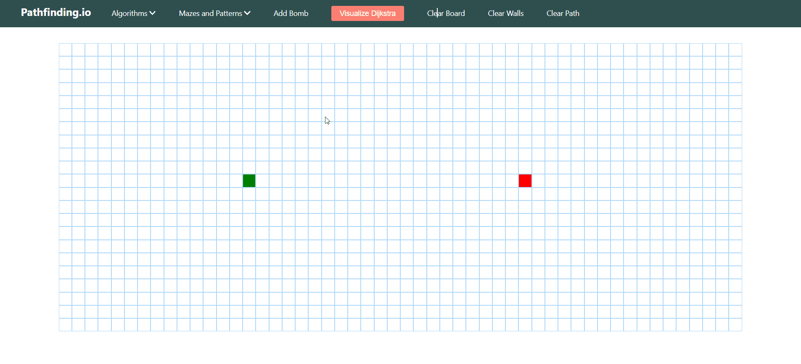
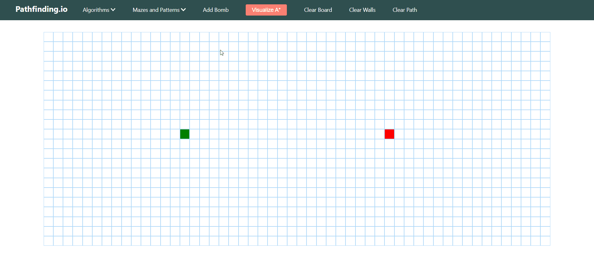
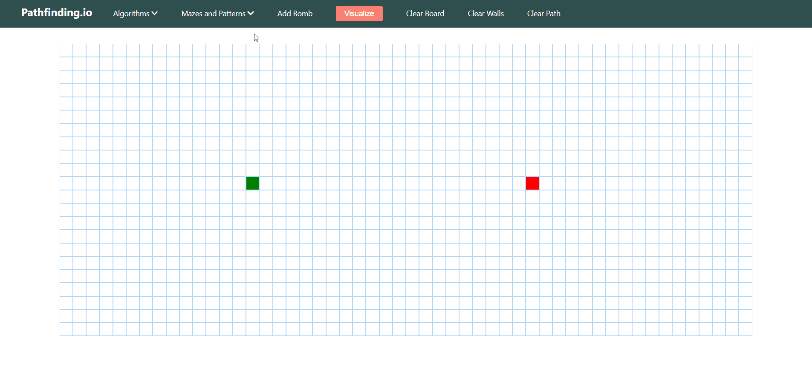

# Pathfinding.io

## I made a Pathfinding visualizer app check it out https://rogermcgrath.github.io/pathfinding/
## This project's main goal is to put popular search algorithms in a visual mean to help them be more understandable. The algorithms being demonstrated are Dijkstra's, Breadth First search, Depth First search, A*, and Greedy Best First search.
---
## Usage   Scrolling over to algorithms you can select whichever algorithm you would like to see and finally hiting vizualize runs the algorithm. Heres this in action
  Making Walls and Changing the Start and End Node   To make the algorithms problems more difficult you could add walls and change where the algorithm starts or where it ends. To make walls you simply click anywhere and drag to make walls.  To change the start or end node you click on your respective node and drag accordingly. Some additional functionality is that if you ran an algorithm and change either node, it will update in real time.   Bomb Nodes    Another feature is the bomb node, a third node which acts as the mid point for the path. This third node acts just like any other node and has the same functionality.  Maze Generation    To generate more complex mazes you can choose from the selected maze types in the maze dropdown menu and see all the algorithms at work within the maze.
---

---
## Changes to be made in the future    This project so far has been a great learning experience for me as it's my first time working with react and really taught me about pathfinding algorithms. Somethings I would like to add is for their to be multiple bomb nodes that the user can add, along with weight nodes as that is an aspect of pathfinding algorithms I never got to implement. Overall I'm very proud of this project and I thank you for checking it out.
---
